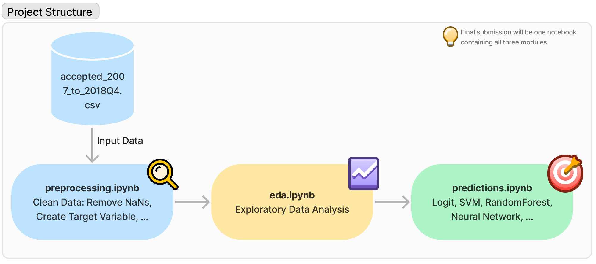

# Bonus Project: Advanced Machine Learning 🚀

Authors of this project are Nina Mertins (2107539) and Alessio Negrini (2106547).
_____
### Project Structure
The project is divided into three different steps:
1. In the `preprocessing` notebook we clean the data, i.e. we remove NaNs attributes, analyze categorical attributes, convert the columns into the correct data type etc. We also define our binary target variable (default (1) and non default (0)). Afterwards we export the preprocessed data and put it into the folder 'data/preprocessed'.
2. In the `eda` notebook we do explanatory data analysis to get a better understanding of our data.
3. In the last notebook `predictions` we implement several classifiers and predictors using models such as Logistic Regression, SVM, Neuronal Networks etc. Also includes comparison of all models and final thoughts and conclusion.

_____
### About this project
This repository contains the bonus project for the lecture 'Advanced Machine Learning' 
by Dr. Nazemi in Summer Semester 2022 at KIT.

The project is about predicting credit default given a set of multiple features, such as interest_rate, balance, monthly income etc... 

A full list of the features can be seen [here](https://drive.google.com/file/d/1UzyKMtrzL3aEEQpeYIz_qjBWyW-lAMr0/view).

____
### How to Use
Go to [Kaggle](https://www.kaggle.com/datasets/wordsforthewise/lending-club/code?datasetId=902) and download the data set. 
Put the file `accepted_2007_to_2018Q4.csv`in the folder `'data/raw'` and run the preprocessing notebook located in the directory 'notebooks'. 
This yields a preprocessed dataframe in the `'data/preprocessed'` folder. Afterwards, you can run the EDA and predictions notebook.
